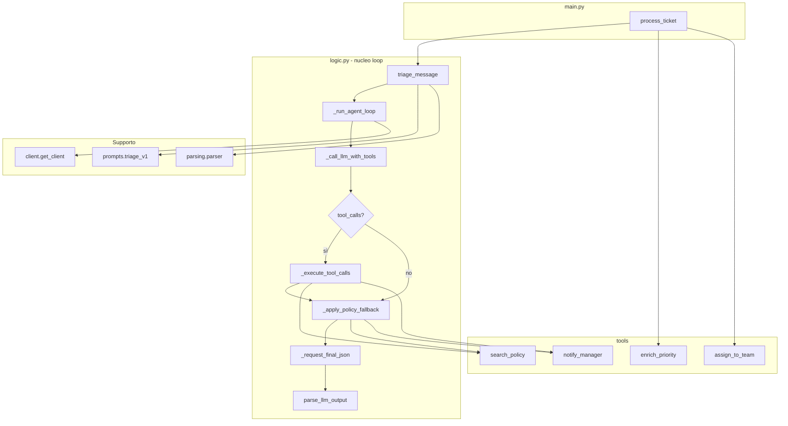
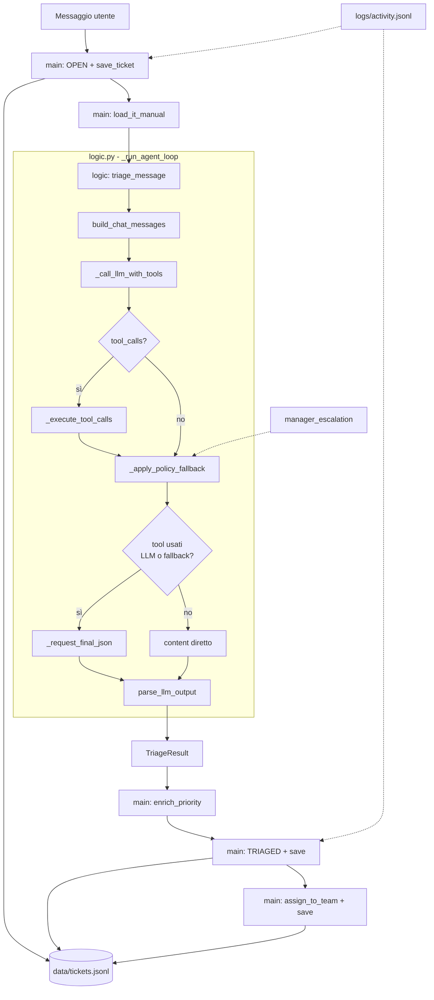
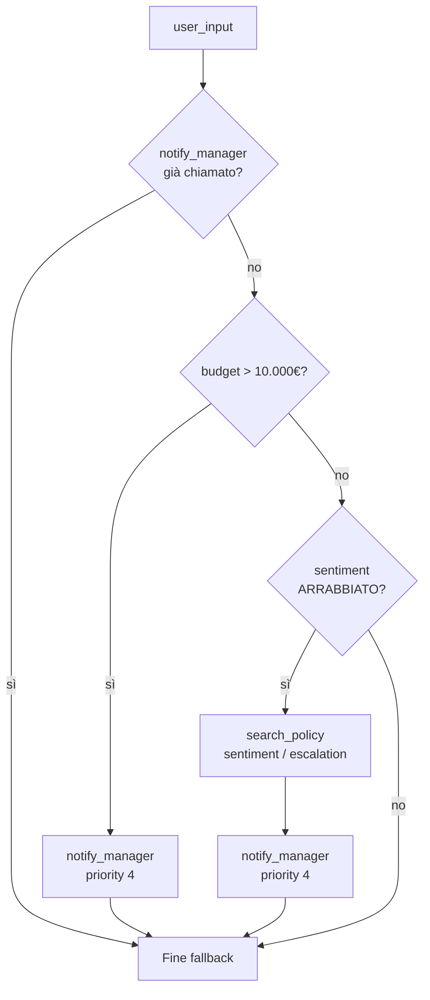
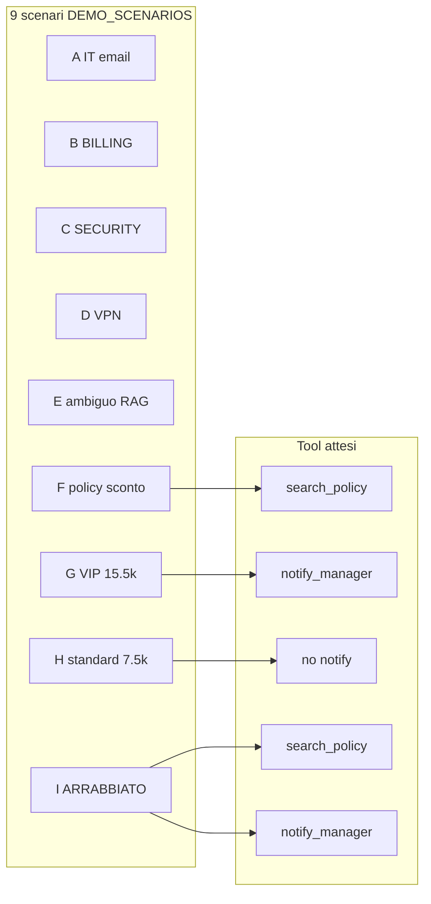

# Agentic Customer Care Triage System

Sistema agentico per il triage e il processamento di ticket customer care. Combina classificazione LLM con ragionamento strutturato (Chain-of-Thought), memoria documentale (manuale IT), tool su policy commerciale, regole deterministiche e persistenza append-only.

## Architettura (3 livelli)

| Modulo | Responsabilità |
|--------|----------------|
| [`client.py`](src/client.py) | Connessione OpenAI (`get_client`, API key da `.env`) |
| [`logic.py`](src/logic.py) | **Nucleo del loop agentico**: input → LLM + tool → esecuzione locale → re-submit → JSON validato |
| [`main.py`](src/main.py) | Orchestrazione: persistenza JSONL, enrichment, routing, scenari demo |

I tool (`search_policy`, `notify_manager`) sono definiti in [`tools/registry.py`](src/tools/registry.py) e implementati in [`tools/office_tools.py`](src/tools/office_tools.py).

### Nucleo del loop (`logic.py`)

1. Riceve l'input e costruisce i messaggi (`build_chat_messages`).
2. Passa `TOOLS_DEFINITION` all'LLM (`_call_llm_with_tools`).
3. Intercetta `tool_calls` ed esegue le funzioni in `TOOL_MAP` (`_execute_tool_calls`).
4. Applica guardie policy con observation in contesto (`_apply_policy_fallback`).
5. Ri-sottomette la conversazione per il JSON finale (`_request_final_json`) → `parse_llm_output`.



| Funzione in `logic.py` | Ruolo |
|------------------------|--------|
| `triage_message` | Entry point pubblico |
| `_run_agent_loop` | Orchestra LLM, tool e fallback |
| `_call_llm_with_tools` | Prima chiamata con `TOOLS_DEFINITION` |
| `_execute_tool_calls` | Esecuzione locale + messaggi `role=tool` |
| `_apply_policy_fallback` | Guardie VIP / ARRABBIATO in conversation |
| `_request_final_json` | Seconda chiamata `response_format=json_object` |

## Funzionalità

| Componente | Descrizione |
|------------|-------------|
| **Triage LLM** | Classificazione in `categoria` e `priorita` con output JSON validato (Pydantic) |
| **CoT** | Campo `analisi_problema` con 4 punti: Problema, Contesto, Categoria, Priorità |
| **Manuale IT** | Contenuto di `data/manuale_it.txt` iniettato nel prompt (es. VPN / GlobalProtect) |
| **Tool agentici** | `search_policy` (RAG su `data/policy.txt`) e `notify_manager` (escalation VIP / sentiment ARRABBIATO) |
| **Fallback policy** | `_apply_policy_fallback`: tool mancanti eseguiti e appenditi alla conversazione prima del JSON finale |
| **Enrichment** | Bump priorità da keyword nel messaggio utente (senza seconda chiamata LLM) |
| **Routing** | Assegnazione `team` per categoria |
| **Logging** | Eventi in `logs/activity.jsonl` (path assoluto da repo root) |

## Pipeline



### Escalation e fallback deterministico

Dopo la prima risposta LLM, `_apply_policy_fallback` valuta `data/policy.txt` e, se serve, **appende alla conversazione** messaggi `assistant` + `tool` (ID `fallback-sp-1`, `fallback-nm-1`) prima di `_request_final_json`:



| Trigger | Criterio (euristica / policy) | Azione fallback |
|---------|------------------------------|-----------------|
| **VIP** | Importo in € **> 10.000** nel testo (es. `15.500€`) | `notify_manager` se assente |
| **ARRABBIATO** | ≥2 segnali tra: minacce legali, maiuscole aggressive, perdite € con cifre, tono ostile | `search_policy` poi `notify_manager` se assenti |

Scenari demo: **G** (15.500€, VIP), **I** (ARRABBIATO); **H** (7.500€) non deve attivare escalation.



Ogni `save_ticket` appende una riga in `data/tickets.jsonl`; l’**ultima riga per `id`** è lo stato corrente.

Fasi di persistenza tipiche per un ticket:

1. `OPEN` — ricezione e ID
2. `TRIAGED` — classificazione + `analisi_problema` + enrichment
3. `TRIAGED` (con `team`) — dopo routing; stesso status, snapshot con team valorizzato

## Output LLM (`TriageResult`)

L’LLM restituisce **solo JSON** (nessun markdown), in questo ordine:

```json
{
  "analisi_problema": "1. Problema: ... 2. Contesto: ... 3. Categoria: ... 4. Priorità: ...",
  "categoria": "IT | BILLING | SALES | SECURITY",
  "priorita": "LOW | MEDIUM | HIGH | CRITICAL",
  "riassunto_breve": "max 15 parole",
  "messaggio_originale": "testo identico all'input utente"
}
```

Il messaggio utente originale non viene sovrascritto in pipeline: l’enrichment legge sempre `messaggio_originale` del ticket, non la copia eventualmente riformulata dal modello.

## Manuale IT e caso VPN

`data/manuale_it.txt` contiene procedure interne (password, VPN, stampanti). Per accesso **da casa alla rete aziendale**, l’agente deve:

1. Inferire il caso **VPN** da «casa» + «rete aziendale»
2. Citare nel `analisi_problema` la voce **Accesso VPN** del manuale
3. Suggerire di verificare che l’app **GlobalProtect** sia attiva

Esempio di ticket:

```text
Ciao, non riesco a collegarmi da casa alla rete aziendale, mi dà errore di connessione.
```

## Scenari demo vs few-shot

I **few-shot** in `prompts/triage_v1.py` stabilizzano il formato JSON e il CoT.  
I **9 scenari** in `main.py` (`DEMO_SCENARIOS`) coprono domini chiari, RAG su manuale IT, policy commerciale, escalation VIP, sentiment ARRABBIATO e progetti standard sotto 10k. I testi demo sono **formulati diversamente** dai few-shot in `triage_v1.py` (stesso dominio, lessico diverso) per ridurre la memorizzazione.

| Scenario | Dominio | Input demo |
|----------|---------|-------------------------|
| A | IT / email | Casella aziendale bloccata |
| B | BILLING | Bonifico / verifica pagamento |
| C | SECURITY | Spam crypto |
| D | IT / VPN | **Ticket studente** (`VPN_STUDENT_TICKET`) |
| E | **SALES vs IT (ambiguo)** | Acquisto corso + pagina pagamento non carica (`AMBIGUOUS_RAG_TICKET`) |
| F | **SALES / policy RAG** | Sconto su corso aziendale (`DISCOUNT_POLICY_TICKET`) — tool `search_policy` |
| G | **SALES VIP / escalation** | Budget 15.500€ + urgenza commerciale (`VIP_ESCALATION_TICKET`, ≠ few-shot Esposito) — `notify_manager` |
| H | **SALES standard (sotto 10k)** | Budget 7.500€ + preventivo (`STANDARD_BUDGET_TICKET`, ≠ few-shot Bianchi) — **no** `notify_manager` |
| I | **Sentiment ARRABBIATO** | Portale down + perdite + minaccia legale (`ANGRY_SENTIMENT_TICKET`) — `search_policy` poi `notify_manager` |

**Few-shot vs demo (G, H, I):**

| Scenario | Few-shot (`triage_v1.py`) | Demo (`main.py`) |
|----------|---------------------------|------------------|
| G VIP | Dr. Esposito, 15.000€, AI Agentic | Ing. Rossi ACME, 15.500€, piattaforma cloud |
| H standard | Società Bianchi, 8.000€, Agile | Verdi & Partners, 7.500€, Scrum |
| I arrabbiato | Sistema down, 12.000€ ricavi | Portale IN DOWN, 20.000€ fatturato |

### Test RAG forte (Scenario E)

Il ticket mescola intento commerciale («acquistare il corso») e sintomo tecnico («pagina di pagamento non carica»). Senza manuale, l’LLM tende a **SALES**; con la voce **Portale pagamenti / acquisti online** in `data/manuale_it.txt` l’agente deve:

| Criterio | Atteso |
|----------|--------|
| `categoria` | **IT** (malfunzionamento portale/checkout) |
| `analisi_problema` | Confronto SALES vs IT; citazione **MANUALE**; blocco tecnico vs richiesta commerciale pura |
| Persistenza | Riga `TRIAGED` in `data/tickets.jsonl` |

```bash
PYTHONPATH=src python -c "
from main import process_ticket, AMBIGUOUS_RAG_TICKET
process_ticket(AMBIGUOUS_RAG_TICKET)
"
```

La disambiguazione usa `SYSTEM_PROMPT`, few-shot (scenario portale pagamenti) e voce **Portale pagamenti** in `data/manuale_it.txt`.

### Scenario F — RAG policy (sconto)

Marco chiede se esiste uno sconto sul budget per un corso aziendale. L’agente deve invocare `search_policy` e leggere `data/policy.txt` (§1.2: nessuno sconto autonomo sotto 10k).

| Criterio | Atteso |
|----------|--------|
| Tool | `search_policy` invocato |
| `categoria` | **SALES** |
| `analisi_problema` | Citazione policy; nessuna promessa di sconto autonomo |

```bash
PYTHONPATH=src python -c "
from main import process_ticket, DISCOUNT_POLICY_TICKET
process_ticket(DISCOUNT_POLICY_TICKET)
"
```

### Scenario G — Escalation VIP (>10k)

Ing. Rossi (ACME Srl) dichiara budget 15.500€ e richiede contatto commerciale entro 48 ore. L’agente deve classificare **SALES** e invocare `notify_manager`. Se l’LLM omette il tool, `_apply_policy_fallback` esegue `notify_manager` e ri-sottomette il contesto per il JSON finale.

| Criterio | Atteso |
|----------|--------|
| Tool | `notify_manager` (log `🚨 [ESCALATION LIVE]`; garantito da `_apply_policy_fallback`) |
| `categoria` | **SALES** |
| `team` | `commerciale` |
| `priorita` | Almeno **HIGH** (urgenza commerciale esplicita; enrichment da keyword nel messaggio) |

```bash
PYTHONPATH=src python -c "
from main import process_ticket, VIP_ESCALATION_TICKET
process_ticket(VIP_ESCALATION_TICKET)
"
```

### Scenario H — Progetto standard (budget sotto 10k)

La società Verdi & Partners dichiara un budget di **7.500€** per un corso Scrum e chiede un preventivo. È un progetto **standard** (sotto la soglia 10k): gestione commerciale normale, **senza** `notify_manager`. Opzionale: `search_policy` per confermare la fascia budget.

| Criterio | Atteso |
|----------|--------|
| Tool | **Non** invocare `notify_manager` |
| `categoria` | **SALES** |
| `team` | `commerciale` |
| `priorita` | **MEDIUM** (richiesta standard) |

```bash
PYTHONPATH=src python -c "
from main import process_ticket, STANDARD_BUDGET_TICKET
process_ticket(STANDARD_BUDGET_TICKET)
"
```

### Scenario I — Sentiment ARRABBIATO (policy + escalation)

Cliente furioso: portale **IN DOWN**, perdita di **20.000€** di fatturato, tono aggressivo e minaccia di **avvocato/denuncia**. L’agente deve leggere `data/policy.txt` (§3.1) con `search_policy`, classificare il sentiment **ARRABBIATO** e invocare `notify_manager`. Se l’LLM omette i tool, `_apply_policy_fallback` appende le observation e chiama `_request_final_json`.

| Criterio | Atteso |
|----------|--------|
| Tool | `search_policy` (sentiment/escalation) poi `notify_manager` |
| `categoria` | **IT** (disservizio portale/infrastruttura) |
| `priorita` | **CRITICAL** |
| Log | `🚨 [ESCALATION LIVE]` |

```bash
PYTHONPATH=src python -c "
from main import process_ticket, ANGRY_SENTIMENT_TICKET
process_ticket(ANGRY_SENTIMENT_TICKET)
"
```

```bash
PYTHONPATH=src python src/main.py
# oppure
PYTHONPATH=src python -c "from main import run_demo_scenarios; run_demo_scenarios()"
```

## Enrichment priorità

Keyword nel `messaggio_originale` (case-insensitive):

| Keyword | Priorità minima |
|---------|-----------------|
| `urgente`, `bloccato`, `bloccata` | HIGH |
| `subito`, `non funziona` | MEDIUM |

La substring `urgente` copre anche «urgentemente» (scenario G). La priorità non viene mai abbassata (es. CRITICAL resta CRITICAL).

## Routing team

| Categoria | Team |
|-----------|------|
| IT | `team_tecnico` |
| BILLING | `amministrazione` |
| SALES | `commerciale` |
| SECURITY | `sicurezza` |

## Struttura progetto

```
agentic-triage-system/
├── pyproject.toml
├── .env                      # OPENAI_API_KEY (non committare)
├── data/
│   ├── manuale_it.txt        # memoria documentale IT (in prompt)
│   ├── policy.txt            # policy commerciale (via tool search_policy)
│   └── tickets.jsonl         # snapshot ticket (gitignored)
├── logs/
│   └── activity.jsonl        # log eventi (gitignored)
├── tests/
│   ├── conftest.py
│   ├── test_parser.py
│   ├── test_store.py
│   ├── test_enrichment.py
│   ├── test_router.py
│   ├── test_logic.py
│   ├── test_tools.py
│   └── test_main.py
└── src/
    ├── paths.py
    ├── main.py               # orchestrazione (save, enrich, route)
    ├── logic.py              # nucleo loop agentico (_run_agent_loop)
    ├── client.py             # connessione OpenAI
    ├── schemas/ticket.py
    ├── prompts/triage_v1.py  # system prompt, few-shot, build_chat_messages()
    ├── parsing/parser.py
    ├── storage/store.py
    └── tools/
        ├── office_tools.py   # search_policy, notify_manager
        ├── registry.py       # schema tool OpenAI
        ├── enrichment.py
        ├── router.py
        └── logger.py
```

## Setup

```bash
python3 -m venv .venv
source .venv/bin/activate
pip install -e ".[test]"
```

Crea `.env` nella root del repository:

```env
OPENAI_API_KEY=sk-...
```

## Esecuzione

**Singolo ticket:**

```bash
PYTHONPATH=src python -c "
from main import process_ticket, VPN_STUDENT_TICKET
process_ticket(VPN_STUDENT_TICKET)
"
```

**Nove scenari demo** (richiede API key e credito OpenAI):

```bash
PYTHONPATH=src python src/main.py
```

## Test

I test **non chiamano l’LLM** (mock su `logic.get_client`). `pytest` aggiunge `src/` al path (`pyproject.toml`).

```bash
pytest tests/ -q
```

| File | Cosa verifica |
|------|----------------|
| `test_parser.py` | JSON valido, assenza JSON |
| `test_store.py` | ID ticket, ultimo snapshot |
| `test_enrichment.py` | Keyword urgente, errore senza priorità |
| `test_router.py` | Routing 4 categorie (parametrizzato) |
| `test_logic.py` | Loop agentico mock; budget/sentiment; fallback con 2 chiamate API e tool in conversation |
| `test_tools.py` | `search_policy` (file + sentiment), `notify_manager`, registry |
| `test_main.py` | 9 scenari demo (A–I) |

**24 test** in totale. Per errori, stati parziali e percorso didattico: [`GESTIONE_ERRORI.md`](GESTIONE_ERRORI.md).

## Riferimenti

- Gestione errori e casi limite: [`GESTIONE_ERRORI.md`](GESTIONE_ERRORI.md)
- Modello: `gpt-4.1-mini`, `temperature=0`
